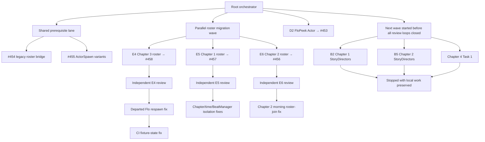
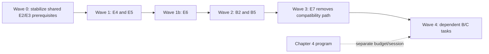

# Agent Fan-Out Session Retrospective — 2026-08-20

## Purpose

This document explains why the session produced meaningful engineering output but consumed a
disproportionate amount of the weekly usage allowance. It records the fan-out structure, identifies
where verification and issue pursuit multiplied work, and proposes a lower-cost execution model for
the remaining migration program.

The user's reported usage change was approximately **100% remaining to 6% remaining**. The visible
published result was six draft pull requests, with three additional tasks left incomplete locally.
That output-to-usage ratio was not acceptable.

## Executive summary

The original decision to parallelize was reasonable: several migration tasks touched different
chapter overlays and could run independently. The implementation of that decision was inefficient.

The main causes were:

1. Agents received too much inherited context, duplicating the cost of the long session history,
   plan material, repository guidance, and skill instructions.
2. Too many lanes were active before the preceding dependency wave was stable.
3. Implementers were told to continue through “discoverable issues,” creating an overly broad
   mandate to investigate integration edges.
4. Separate review lanes repeated repository reading and verification before implementation lanes
   had fully settled.
5. Godot import, focused tests, broad tests, smoke checks, root re-verification, and CI were often
   layered on top of one another instead of forming a single verification ladder.
6. Stacked branches changed while agents were working, causing compatibility bridges,
   cherry-picks, conflict resolution, and repeated CI cycles.
7. Progress was measured implicitly by activity and PR production, not by completed plan tasks per
   unit of usage.

The agents did not independently “go rogue.” The root orchestration created the behavior by issuing
broad discovery instructions, adding independent review agents, and continuing to open new lanes.

## What the session produced

### Published draft PRs

| PR | Work | End state during the session |
| --- | --- | --- |
| #453 | FloPeek promoted to `Actor` | Published; CI green |
| #454 | Legacy follower-to-roster compatibility bridge | Published; CI green |
| #455 | Same-ID gated `ActorSpawn` variant selection | Published; CI green |
| #456 | Chapter 2 actor placement and party migration | Published; CI green |
| #457 | Chapter 1 actor placement and party migration | Published; CI green |
| #458 | Chapter 3 actor placement and party migration | Published; CI green |

Several prerequisite tasks also landed upstream during the session, including Tracks A2–A4, B1,
B10, D1, E1–E3, and supporting documentation work. Those upstream changes affected the bases of
the in-flight stacks.

### Preserved unfinished work

| Task | Preserved state when stopped |
| --- | --- |
| B2 — Chapter 1 CV StoryDirectors | Local commit `19daf11`; final verification/publication incomplete |
| B5 — Chapter 2 CV StoryDirectors | Substantial uncommitted implementation, including `ActorPresent` vocabulary work |
| Chapter 4 T1 — `check_goals` state work | Uncommitted implementation in its isolated worktree |

## How the fan-out was structured



At peak, the root orchestrator and three agents were active concurrently. When one agent completed,
its slot was quickly reused for another implementation or review lane. This kept concurrency high
but left no meaningful usage checkpoint between waves.

## Where efficiency was lost

### 1. Full-context agent forks

Multiple agents inherited the full conversation history. By that point the history contained:

- all seven plan documents and their cross-track dependencies;
- repository and runtime guidance;
- skill instructions;
- earlier agent messages and integration findings;
- PR state, worktree state, verification details, and local environment caveats.

Most agents needed only one bounded task packet and a few prerequisite commit hashes. Passing the
entire history repeatedly increased context cost without improving task isolation.

### 2. Broad “discoverable issue” instructions

Agent briefs included language such as “keep working through discoverable issues.” That instruction
was intended to prevent unnecessary blocking questions, but it failed to distinguish between:

- a defect that directly prevented the task's stated done condition;
- a prerequisite incompatibility that required coordination;
- an adjacent bug or coverage opportunity that should have been recorded and deferred.

The result was rational local behavior but poor global cost control. Agents investigated anything
that plausibly threatened integration, while the root continued opening new lanes.

### 3. Premature independent review lanes

Review agents were launched for E4, E5, and E6. They found real defects:

- Chapter 2's morning consequence updated a legacy flag without joining CV to the roster;
- Chapter 3 could respawn sleeping Flo after she had left the party;
- Chapter 1 wiring tests leaked global chapter time and BeatManager state.

These findings were valuable, but each review duplicated code reading and produced another
fix–test–push–CI loop. Reviews began before the complete dependency wave had stabilized, so their
cost accumulated on top of integration churn rather than replacing it.

### 4. Repeated verification layers

The effective verification pattern often became:

1. create or refresh a Godot import cache in an isolated worktree;
2. run focused GUT suites;
3. run broader GUT suites;
4. run architecture lint and its unit tests;
5. run a boot smoke check;
6. attempt a GUI/editor or hand-replay check;
7. clean generated import churn;
8. have the root rerun focused tests after integration;
9. push and run the full CI suite;
10. repeat part of the sequence after review findings.

Godot imports were especially expensive because separate worktrees needed separate caches, and the
local environment required redirected runtime directories. Some GUI checks hung and yielded no
useful evidence, but still consumed time and agent effort.

The verification work was individually defensible; the duplication across agents, root, and CI was
not.

### 5. Stacked-branch integration churn

E4, E5, and E6 depended on shared E2/E3 behavior while related prerequisites were merging upstream.
This produced several extra integration tasks:

- a temporary legacy follower compatibility bridge;
- a static-reference autoload compile cycle and a cycle-safe follow-up;
- multiple same-ID `ActorSpawn` selection behavior;
- clean publication stacks rebuilt from newer master commits;
- cherry-picks and conflict resolution against evolving chapter-state code.

The bridge and variant fixes were legitimate, but parallelizing dependents before their shared base
was stable multiplied the number of branches that needed to understand or carry those fixes.

### 6. Expanding into the next wave too early

B2, B5, and Chapter 4 T1 were started while the E4 review/CI loop was still active. B2 and B5 then
encountered plan gaps of their own:

- plan activator paths were stale after actors moved under `ActorSpawn` containers;
- B5 required a typed `ActorPresent` condition node that the vocabulary did not yet provide.

Starting these tasks was not logically invalid, but it spent the remaining budget on new setup and
discovery before the current wave had reached a clean stopping point.

### 7. No explicit usage budget or stop rule

The session had no checkpoints such as:

- maximum agents or task starts per wave;
- maximum verification passes before relying on CI;
- maximum adjacent findings pursued per task;
- minimum remaining weekly allowance required to start another lane;
- automatic stop when a wave has publishable handoffs.

The user asked the agent to keep working, and the orchestration interpreted that as continuous
expansion instead of continuous progress within a controlled budget.

## Issue pursuit: useful findings versus costly scope growth

The distinction below is important for refining the process. The lesson is not “never investigate
issues”; it is to classify them before spending another lane on them.

| Finding | Classification | Better handling |
| --- | --- | --- |
| Chapter 2 morning did not join CV to roster | Direct done-condition blocker | Fix within E6 before publication |
| Chapter 3 departed Flo could respawn | Direct E4 behavioral blocker | Fix within E4, but without a separate full-context reviewer if a contract checklist could catch it |
| Static autoload compile cycle in compatibility bridge | Shared prerequisite blocker | Stabilize shared prerequisite before starting E4/E5/E6 |
| Same-ID ActorSpawn variants could both survive | Shared prerequisite blocker | Resolve once in E2 before dependent chapter migrations |
| Chapter 1 test leaked night state | CI/test-isolation blocker | Focused fix, then rely on CI; no additional broad review pass |
| Missing B5 `ActorPresent` node | Task-scoped vocabulary gap explicitly anticipated by plan | Add within B5 using a narrow subtask packet |
| Non-blocking extra gate assertions | Coverage opportunity | Record for later; do not restart the PR loop |

## Recommended execution model

### 1. Work in dependency waves with hard closure

Do not start the next wave until every task in the current wave is either:

- published and CI green;
- explicitly deferred with a concise blocker;
- stopped with a clean, documented handoff.

For this migration, a better sequence would have been:



Chapter 4 should have remained a separate session or explicit budget lane instead of being added
while the chapter-migration stack was still settling.

### 2. Cap concurrency at two implementation agents

Recommended default:

- root orchestrator;
- at most two bounded implementation agents;
- no independent reviewer agent until both implementation slots are idle.

This retains meaningful parallelism without multiplying context and verification four ways.

### 3. Use narrow task packets, not full-history forks

Each agent should receive only:

- the exact task section from the plan;
- the relevant prerequisite commit or branch;
- allowed files and done conditions;
- one focused test command;
- known repository caveats needed for that task;
- a strict rule for handling adjacent findings.

The agent should not inherit the full session unless the task genuinely requires global
coordination context.

### 4. Replace open-ended discovery with a triage rule

Suggested instruction:

> Fix only findings that make this task's explicit done condition false. For an adjacent issue,
> record the path, evidence, and recommended owner in the handoff, then continue or stop without
> investigating further. Do not expand shared infrastructure unless the root approves the specific
> change.

This preserves autonomy without authorizing unbounded bug searching.

### 5. Use one verification ladder

#### Implementer

- Import once per worktree, only if required.
- Run the smallest focused regression suite.
- Run affected lint only when the task touches linted architecture.
- Commit a clean diff and report commands/results.

#### Root

- Review the diff and test evidence.
- Do not rerun passing focused tests unless integration changed the code.
- Resolve stacking conflicts once on the publication branch.
- Push once.

#### CI

- Own the full GUT suite, complete lint, and smoke check.
- If CI fails, run only the failing test plus its immediate predecessor when checking state leaks.
- Push the fix and let CI provide the next full run.

GUI/hand replay should be performed only when the plan's behavior cannot be represented by an
automated contract and the desktop tooling is known to be available.

### 6. Review from a checklist before spawning a reviewer

Each plan task should have a short root review checklist derived from its done condition. For E4,
for example:

- each party join/leave occurs in authored order;
- every actor appearance has required and blocked gates;
- re-enter each area after every departure flag;
- party membership overrides the intended spawn gate;
- no deleted chapter-state property remains referenced.

Only spawn an independent reviewer when risk justifies the additional context cost or the user asks
for one.

### 7. Add usage checkpoints

Before starting a new wave, report:

- completed tasks and published PRs;
- remaining tasks in the current plan;
- current number of active agents;
- whether the next task adds a new worktree/import/full-CI cycle;
- a clear stop/go recommendation based on remaining allowance.

The user should receive that checkpoint before a significant new portion of the weekly budget is
committed.

## Proposed agent brief template

```text
Task: <one plan task only>
Base: <exact commit or branch>
Allowed scope: <files/subsystem>
Done condition: <copied from plan>
Verification: <one focused command; CI owns the full suite>

Boundary:
- Fix only blockers to the stated done condition.
- Record adjacent issues without investigating or fixing them.
- Do not add shared infrastructure unless explicitly listed in the task.
- Stop after a clean commit and concise handoff; do not push.

Context:
<only the prerequisite facts this task needs>
```

## Proposed session-level stop conditions

Stop the session and hand off when any one is true:

1. The current dependency wave is published and CI green.
2. Two consecutive tasks expose an unplanned shared-infrastructure dependency.
3. A full verification loop has already been repeated once for the same PR.
4. A GUI verification attempt fails or hangs once; record it instead of retrying in another lane.
5. Remaining allowance crosses a user-agreed threshold.
6. The next ready work belongs to a different program, such as moving from Chapter Migration to
   Chapter 4 Completion.

## Bottom line

The session's engineering output was real, and several issues found during review would have caused
behavioral regressions. The inefficiency came from discovering and validating those issues through
too many simultaneous full-context lanes, while continually starting more work.

The refined process should preserve fan-out but make it **narrow, wave-based, budget-aware, and
verification-once**. Parallelism should reduce elapsed time, not multiply the amount of reasoning,
repository reading, and test execution performed for each completed task.
